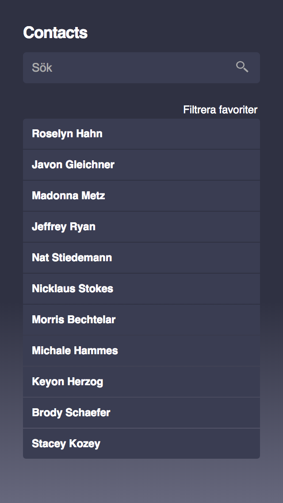
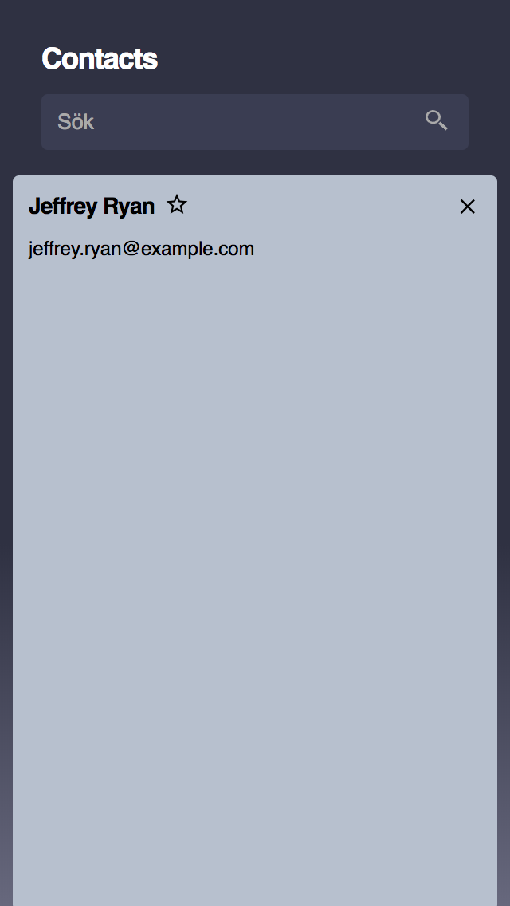

Kodprov frontend
================
Det här är ett kodprov för dig som söker jobb som frontend-utvecklare hos Beamon People.  

Uppgiften
---------
I denna mapp finns en enkel webbapp för att visa en kontaktlista. Det går att se
en detaljerad vy för varje kontakt och markera kontakten som favorit. Det finns
även en sökfunktion och möjlighet att filtrera listan så att enbart favoriter visas.  

1. Den nuvarande versionen av koden innehåller flera exempel på mindre bra kod.
Den ena delen av uppgiften är att refaktorera och förbättra koden för att visa dina
kunskaper inom olika delar av frontend-utveckling så som markup, javascript och
styling.
Du får gärna göra ganska omfattande ändringar i alla delar av koden, inklusive
att använda ramverk, men var beredd att motivera dem och berätta hur du har resonerat.   

2. Den andra delen av uppgiften är att ändra webbappens utseende så att det matchar
_mobile first_-designen som finns i bilderna sist i detta dokument (det behöver
inte vara pixel-perfekt).  

Vi tycker om konsekvent, skalbar och modulär kod. Best practices och
tillgänglighet är bra.
Webbappen bör fungera i senaste versionen av Chrome eller Firefox.  

Tveka  inte  att  fråga  om  du  undrar  något!  Lycka  till!  

Färger
------
Här är de färger som används i designen:  
`#2f3142`  
`#67687d`  
`#fff`  
`#000`  
`#3a3d52`  
`#aaa`  
`#3a3d52`  
`#4e536f`  
`#b7c0ce`  

Designbilder
------------  

Utgå från designbilderna nedan som gäller den mobila versionen av webbappen.
I mappen _assets_ finns grafik som du kan använda.

  
Överblicksvy: Lista över kontakter  

  
Detaljerad vy: Kontaktuppgifter för en person
